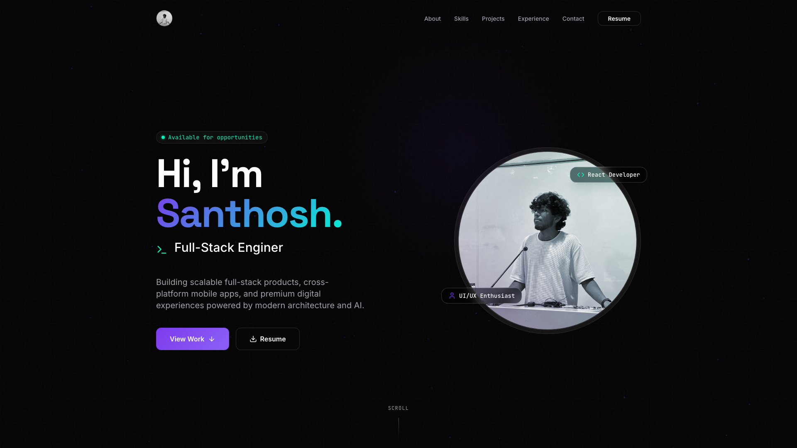

<div align="center">
  <br />
    <a href="https://santhosh-vs-portfolio.vercel.app/" target="_blank">
      
    </a>
  <br />

  <div>
    
    
    
    
    
    
  </div>

  <h2 align="center">💼 Santhosh VS – Personal Portfolio Website</h2>

  <p align="center">
    A modern and fully responsive personal portfolio built with React, TypeScript, Tailwind CSS, Framer Motion, and shadcn/ui.  
    Showcasing my projects, skills, and professional journey with a clean UI, dark/light theme toggle, and smooth animations.
  </p>

[](https://santhosh-vs-portfolio.vercel.app/)

</div>

---

## 📋 Table of Contents

1. 📖 [Introduction](#introduction)
2. ⚙️ [Tech Stack](#tech-stack)
3. ✨ [Features](#features)
4. 🚀 [Featured Projects](#featured-projects)
5. 💻 [Getting Started](#getting-started)
6. 📞 [Connect With Me](#connect-with-me)
7. ⭐ [Show Your Support](#show-your-support)

---

### <a name="introduction">📖 Introduction</a>

**Santhosh VS – Portfolio Website** is my personal space on the web to showcase my work, skills, and experiences.  
It’s built using modern frontend technologies with an emphasis on performance, responsiveness, and design.

Key highlights include:

- A clean, minimal, and visually appealing interface.
- Fully responsive layout that adapts to any screen size.
- Smooth animations for an engaging browsing experience.
- A dedicated section for a wide variety of full-stack, mobile, 3D experience, and frontend projects.

---

### <a name="tech-stack">⚙️ Tech Stack</a>

- **[React 18](https://react.dev/)** – Component-based UI development.
- **[Vite](https://vitejs.dev/)** – Fast, modern build tool.
- **[TypeScript](https://www.typescriptlang.org/)** – Typed JavaScript for scalability.
- **[Tailwind CSS](https://tailwindcss.com/)** – Utility-first styling.
- **[shadcn/ui](https://ui.shadcn.com/)** – Pre-styled, accessible components.
- **[Framer Motion](https://www.framer.com/motion/)** & **[GSAP](https://gsap.com/)** – Advanced animations and transitions.
- **[Lenis](https://lenis.darkroom.engineering/)** – Smooth scrolling.

---

### <a name="features">✨ Features</a>

👉 **Dark/Light Theme Toggle** – Saved in `localStorage`.  
👉 **Responsive Design** – Optimized for desktop, tablet, and mobile.  
👉 **Smooth Animations** – Clean transitions, parallax effects, and scroll-driven animations using Framer Motion and GSAP.  
👉 **Dedicated Sections** – About, Experience, Projects, Skills, Contact.  
👉 **Extensive Project Showcase** – Detailed cards with video previews, category filtering, and direct links.

---

### <a name="featured-projects">🚀 Featured Projects</a>

The portfolio showcases a variety of projects spanning different technologies:

- **Feasto 🛵:** A production-grade microservices food delivery ecosystem built with React, Node.js, RabbitMQ, Socket.IO, MongoDB, and Docker.
- **Recurio 📱:** A premium, high-fidelity Expo & React Native application to track, manage, and optimize recurring subscriptions.
- **QuickShow 🎟️:** A modern movie booking platform with real-time seat booking, secure Stripe payments, and automated background workflows.
- **HVF e-Leave Portal:** Web-based leave management system developed during In-Plant Training at HVF, Avadi.
- **Nimbus Keyboards ⌨️:** An immersive 3D interactive website that brings keyboards to life built with Next.js, TailwindCSS, Prismic CMS, and React Three Fiber.
- **Velvet Pour 🍹:** A scroll-driven, animated cocktail website built with React, GSAP, and Tailwind CSS.

_...and many more full-stack, mobile, and 3D web experiences!_

---

### <a name="getting-started">💻 Getting Started</a>

**Clone the Repository**

```bash
git clone https://github.com/Itssanthoshhere/Portfolio.git
cd Portfolio
```

**Install Dependencies**

```bash
npm install
```

**Run Development Server**

```bash
npm run dev
```

---

### <a name="connect-with-me">📞 Connect With Me</a>

- 🌐 Portfolio: [santhosh-vs-portfolio.vercel.app](https://santhosh-vs-portfolio.vercel.app/)
- 💼 LinkedIn: [Santhosh VS](https://linkedin.com/in/thesanthoshvs)
- 🐙 GitHub: [Itssanthoshhere](https://github.com/Itssanthoshhere)

---

### <a name="show-your-support">⭐ Show Your Support</a>

If you like this project, **please give it a star** ⭐ on GitHub and share it with your friends!

---

> 💡 Designed & Developed by **Santhosh VS**
